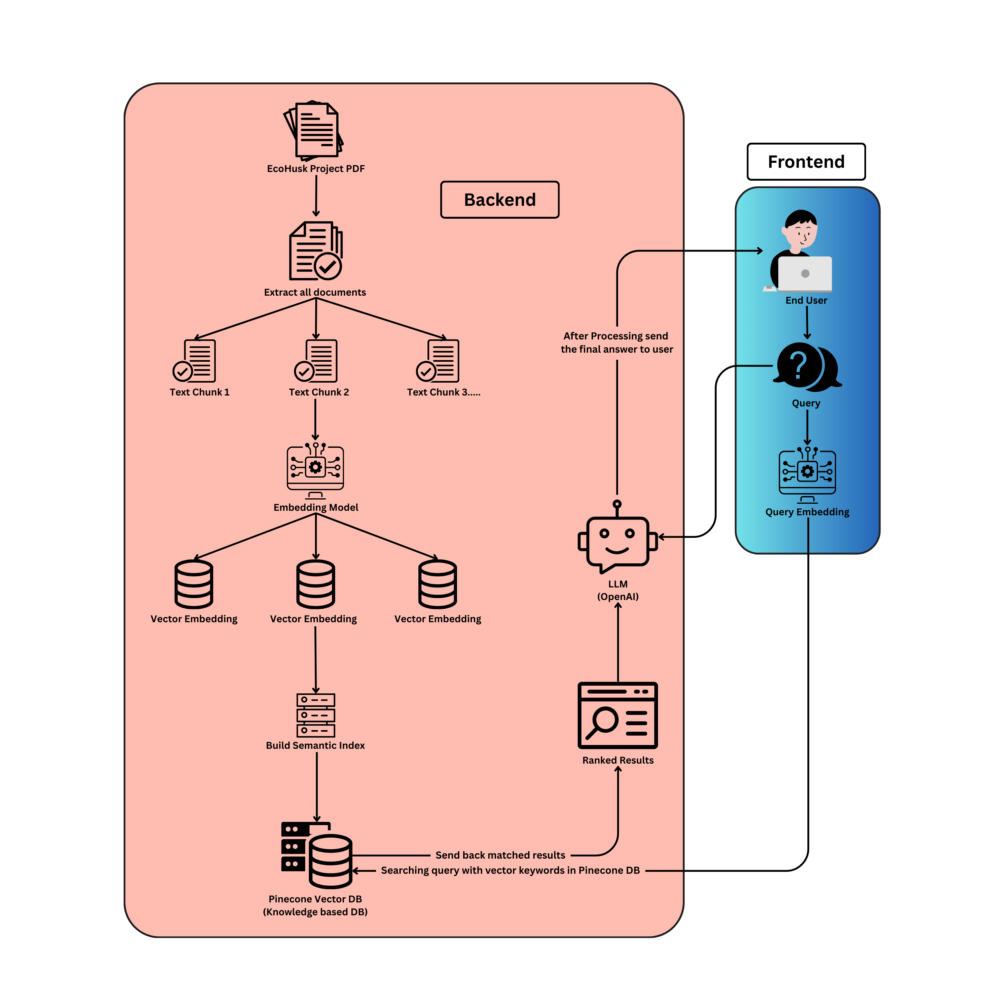

# EcoHusk.AI — Personalized Multilingual Chatbot for the EcoHusk Project

EcoHusk.AI is a fully customized, intelligent, and multilingual chatbot designed to answer questions related to the EcoHusk project. The system integrates advanced LLM techniques with vector databases to create a seamless question-answering experience for users through a web-based GUI.<br><br>

## Screenshot of GUI APP
<p align = "center">
  


<br>


</p>

<br>

## About the EcoHusk Project

The EcoHusk project is an innovative eco-friendly and sustainable system that utilizes **rice husk** to produce:
- **Electricity**
- **Activated carbon**
- **Nitrogen gas**
- **Water purification systems**
- **RHA bricks and concrete mixtures**

By producing multiple valuable outputs from a single process, EcoHusk increases energy efficiency and economic value, contributing to green energy and sustainable development goals.

</br>

## Technologies Used

- **LLM Integration**: OpenAI GPT model for advanced question answering
- **Embeddings**: HuggingFace transformer model: `sentence-transformers/all-MiniLM-L6-v2`  
  → [Visit model page](https://huggingface.co/sentence-transformers/all-MiniLM-L6-v2)
- **Vector Database**: Pinecone for vector storage and similarity search  
  → [Visit Pinecone](https://www.pinecone.io/)
- **Frontend**: Flask-based web GUI with dynamic theme and multilingual support
- **PDF Parsing**: Langchain + PyPDFLoader
- **Environment Management**: Conda virtual environment
- **Prompt Customization**: `prompt.py` for personalized assistant behavior

</br>

## Project Setup Guide

### Initial Setup

1. Create GitHub Repository
2. Clone the Repo
   ```bash
   git clone https://github.com/your-username/EcoHusk-Chatbot-LLM-Project.git

3. Open Project using VS Code or any preferred IDE.

4. Create & Activate Environment

   ```bash
   conda create -n EcoHusk python=3.10
   conda activate EcoHusk

5. Install Dependencies

   ```bash
   pip install -r requirements.txt

6. Configure Local Package
Ensure the correct folder structure and run:

   ```bash
   pip install -e .

<br><br>

### Backend Workflow
1. Select the Correct Kernel in VSCode
Use the conda environment created.

2. PDF Data Extraction
PDFs in the `Data/` directory are loaded using Langchain loaders.

3. Text Chunking
Use `RecursiveCharacterTextSplitter` with:

                chunk_size = 500  
                chunk_overlap = 30
   
        Output: 42 chunks

4. Generate Embeddings
Using [HuggingFace model.](https://huggingface.co/sentence-transformers/all-MiniLM-L6-v2)

5. Pinecone Setup

- Create account at [pinecone.io](https://www.pinecone.io/)

- Generate API key

- Create a DB index (e.g., `ecohusk`)

6. Store Vector Embeddings
Upload the chunk embeddings into the Pinecone index.

7. OpenAI API Integration

- Create an account at [OpenAI](https://platform.openai.com/api-keys)

- Get your `OPENAI_API_KEY`

8. Build the Retrieval Chain

- Retrieve context chunks from Pinecone

- Use OpenAI GPT model for intelligent answer generation<br><br><br>

### Frontend (Web UI)
1. Flask Setup
- Flask server (`app.py`) runs backend + frontend

2. Templates & Static Folder

- `templates/chat.html`: Frontend chatbot interface

- `static/style.css`: Dynamic styling and themes

3. Prompt Customization

- `prompt.py` file allows easy editing of system prompt logic

4. Chatbot Execution

    ```bash
    python app.py
  Then visit `http://localhost:8080` in browser<br><br><br>


### Execution Steps
    ```bash
    conda activate EcoHusk4
    python app.py
  Then open http://localhost:8080 in your browser.<br><br><br>

## Peoject Architecture

  

## Notable Features
- Personalized for EcoHusk: Trained with custom project data for highly relevant answers

- Handles Greetings and Emotions: Responds to greetings, polite questions, and user sentiment

- Multilingual: Works with multiple languages, including Bangla, English, and more

- Powered by OpenAI API: High-quality, context-aware answer generation

- Vector Search: Fast and scalable document retrieval via Pinecone

- Interactive UI: Web chat interface with dynamic dark/light mode

- Prompt Flexibility: Easy customization via prompt.py file<br><br><br>


## License
  This project is for academic and demonstration purposes under the [MIT License.](LICENSE)<br><br><br>


## Contact
**RAOHA BIN MEJBA (李一含)**

Project Lead, EcoHusk

Email: raoha@mail.ustc.edu.cn <br><br><br><br><br><br>


**NOTE: For security concern API Key of OpenAI and Pinecone is not shared. These were locally saved in .env file during execution.**
